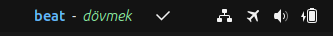

# Oxford 3000 Word Trainer \[TR-EN]



**Oxford 3000 Word Trainer \[TR-EN]** is a simple yet effective English vocabulary repetition extension developed for GNOME Shell. It resides in your panel and displays random English-Turkish word pairs, updating with a new word every 10 seconds. You can mark words you've learned to prevent them from being shown again.

## Features

* English-Turkish word display in the GNOME panel
* Automatic word rotation every 10 seconds
* Ability to mark known words to skip them in the future
* Daily memory tracking based on the last usage date
* Persistent settings and word data stored in `settings.json` and `vocabulary.json`

## Installation

1. Clone this extension from the GitHub repository:

```bash
git clone https://github.com/huseyincorakli/3000oxford-huseyincorakli
```

2. Copy the folder to the GNOME Shell extensions directory:

```bash
mkdir -p ~/.local/share/gnome-shell/extensions/
cp -r oxford3000-vocab-extension ~/.local/share/gnome-shell/extensions/3000oxford@huseyincorakli
```

3. Enable the extension:

```bash
gnome-extensions enable 3000oxford@huseyincorakli
```

4. Restart GNOME Shell:

* Shortcut: Press `Alt + F2`, type `r`, and hit Enter

## Usage

* A random English word and its Turkish translation will appear in your panel.
* A new word will be shown every 10 seconds.
* When you click the checkmark, the word is marked as known and won’t be displayed again (saved in `settings.json`).

## Source

The vocabulary json is taken from:
[Oxford 3000 TR-EN List](https://gist.github.com/CagriAldemir/b5313cc134c07dc9c41951999252231b) - [@CagriAldemir](https://gist.github.com/CagriAldemir)!
